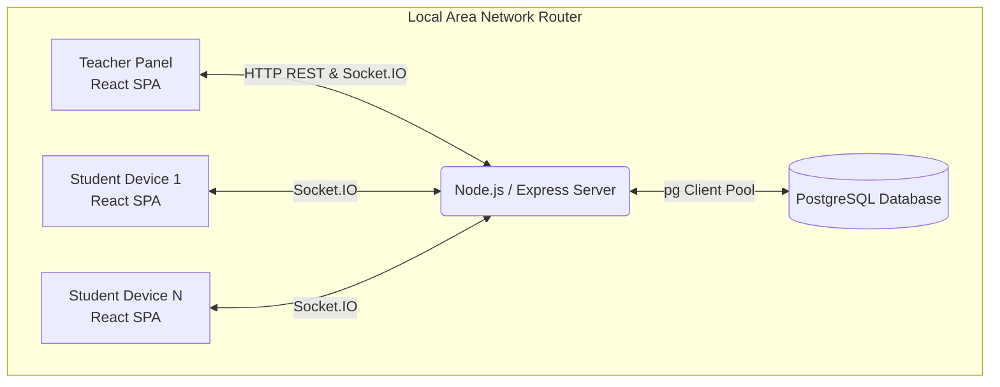
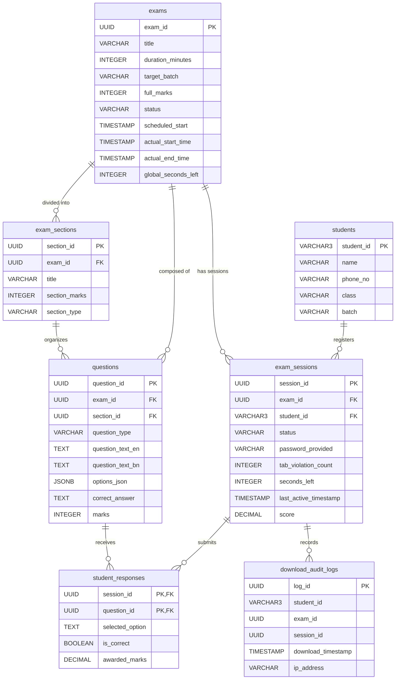

# 🏫 Local Area Network (LAN) Exam Management System

A robust, real-time, and resilient examination management platform designed for Local Area Network (LAN) classroom environments. Built specifically for the **Institute of Computer Science and Technology (ICST), Chowberia**, this platform enables teachers to easily author multi-format exams, register students, and monitor progress in real-time, while enforcing strict anti-cheat tab-switching guards.

---

## 🌟 Key Features

*   **Real-Time Synchronized Control**: The teacher manages exam states globally (Start, Pause, Resume, Stop, Reset) with changes pushed instantly to students via WebSockets (Socket.IO).
*   **Anti-Cheat Protection (Tab Lock)**: Student focus loss (tab switching, opening other apps, minimizing) triggers a tab violation, immediately locks their browser workspace, and flags their record in red on the teacher console. The student can only resume after a manual unlock by the teacher.
*   **Disconnection & Power-Cut Resilience**: All answers are saved to a PostgreSQL database on every change. If a student's computer restarts or connection drops, they can log back in immediately to resume exactly where they left off with their previous answers and remaining time synced automatically.
*   **Multilingual Questions Support**: Features a toggle for side-by-side or individual **English** and **Bengali** translations for questions.
*   **Multiple Question Types**:
    *   *Multiple Choice Questions (MCQ)*
    *   *Fill in the Blanks (FITB)*: Features an interactive pool of shuffled options for drag-and-drop blank insertion.
    *   *True or False (TF)*
    *   *Left-Right Matching Columns (MATCH)*: Interactive matching interface mapping left elements to right targets.
*   **Report Generation & Exports**: Teachers can export tabular student grade sheets to PDF/JPG and print beautiful individual answer sheets detailing student inputs, correct key matchings, and color-coded mark breakdowns.
*   **Download Auditing**: Stores IP addresses and timestamps of students downloading reference files or certificates.

---

## 🏗️ System Architecture



---

## 🗄️ Database Schema & Relationships



---

## 🛠️ Technology Stack

| Component | Technology | Description |
| :--- | :--- | :--- |
| **Frontend** | React 19, TypeScript, Vite, Tailwind CSS v4, Lucide Icons | Responsive client-side application. |
| **Backend** | Node.js, Express, Socket.IO, TypeScript | Real-time WebSocket communications & REST APIs. |
| **Database** | PostgreSQL 15 | Relational database mapping student details and logs. |
| **DevOps** | Docker, Docker Compose | Seamless database deployment inside container environments. |
| **Libraries** | jsPDF, html2canvas, html-to-image | Automated script components for sheet/record generation. |

---

## 🚀 Installation & Setup

### 1. Prerequisites
Ensure you have the following installed on the host machine:
*   [Node.js](https://nodejs.org/) (v18 or higher recommended)
*   [Docker Desktop](https://www.docker.com/products/docker-desktop/) (Must be open and running)
*   [Git](https://git-scm.com/)

---

### 2. Quick One-Click Setup (Recommended)
We provide a `start.bat` script in the root directory. To boot the system automatically:
1. Double-click **`start.bat`** in Windows Explorer (or run `.\start.bat` in your terminal).
2. The script will:
    *   Spin up the PostgreSQL database container.
    *   Open a new window running the backend REST/WS server.
    *   Open another window running the Vite frontend dev server (configured to broadcast across the LAN).
3. To stop all servers, simply close the opened command terminal windows.

---

### 3. Manual Step-by-Step Setup

#### Step A: Database Configuration
1. Start the Docker containers:
   ```bash
   docker-compose up -d
   ```
2. Navigate to the backend directory, install packages, and execute the initialization script:
   ```bash
   cd backend
   npm install
   npx ts-node src/db/setup.ts
   ```
   *(This executes the `src/db/schema.sql` database configuration and inserts sample student batches and demo exams.)*

#### Step B: Start Backend REST/Socket Server
1. From the `backend` folder, run:
   ```bash
   npx ts-node src/index.ts
   ```
   *(Server starts listening at `http://localhost:3001`)*

#### Step C: Start Frontend React Client
1. Open a new terminal in the `frontend` folder:
   ```bash
   cd frontend
   npm install
   npm run dev -- --host
   ```
   *(The `--host` flag is crucial to broadcast the Vite app over your local Wi-Fi router network.)*

---

## 🌐 LAN Connectivity: Student Access

To connect student machines to the exam portal:
1. Get the host/teacher computer's **IPv4 address**:
   *   *On Windows*: Open Command Prompt, run `ipconfig`, and locate "IPv4 Address" (e.g., `192.168.1.15`).
2. Make sure student devices are connected to the **same Wi-Fi router or local LAN switch**.
3. Direct student web browsers to the following URL:
   ```http
   http://<TEACHER_IP_ADDRESS>:5173
   ```
   *(Example: `http://192.168.1.15:5173`)*

---

## 🧑‍🏫 Teacher Workspace Panel (`/teacher`)

Access the teacher controls at `http://localhost:5173/teacher` (or from LAN at `http://<TEACHER_IP_ADDRESS>:5173/teacher`).

> [!NOTE]
> **Dashboard Security:** The panel is secured by a master password. 
> *   **Master Password:** `ICST`

### Dashboard Sections:
1.  **Monitor Tab**: Allows the teacher to select a published exam to live-track.
    *   *Initialize Exam*: Generates login credentials for all registered students in the target batch. (Login format: Student Name first word in uppercase + `@` + Student ID, e.g. `RAHUL@001`).
    *   *Start Exam*: Signals students to begin. Starts the synchronous timer.
    *   *Pause / Resume / Stop*: Global exam administration controls.
    *   *Unlock Student*: Resets a student's blocked status back to `EXAMINEE` after tab violations.
    *   *Hard Reset Student*: Deletes the student's active exam session completely, allowing them to restart from scratch.
2.  **Registration Tab**: Add, edit, or search registered students. Filters entries by name, ID, class, and batch.
3.  **Exams Tab**: Create exam drafts, define exam details (duration, target batch, points), and build sections. Supports adding questions with English & Bengali translation pairs.
4.  **Results Tab**: Displays real-time grade lists once exams end.
    *   *Download Excel/PDF Grade Sheets*: Save full scoresheets.
    *   *View Answer Sheets*: Allows printing or saving individual student graded answer sheet PDFs displaying precise student responses, correction flags, and mark breakdowns.

---

## 🛡️ Anti-Cheat (Visibility Detection)

The student client app monitors window focus changes (`document.visibilityState` and `window.onblur`):
1.  When a student clicks off the browser window, opens another application, or switches tabs:
    *   The browser triggers a `tab_violation` event.
    *   The client app automatically saves current inputs and sends a violation event to the backend.
    *   The student's browser screen locks, showing a warning: *"Your exam has been paused due to tab-focus violation. Contact teacher to resume."*
2.  On the **Teacher Panel**, the student's card turns red, displaying the incremented tab violation count.
3.  The teacher can unlock the student after a warning. Clicking **Unlock** sends a websocket message to the client, releasing the lock screen.

---

## 📡 API & Socket.IO Specs

### REST API Directory
*   `GET /api/health` — API health status validation.
*   `GET /api/students` | `POST /api/students` | `DELETE /api/students/:id` — Manage students registry.
*   `GET /api/exams` | `POST /api/exams` | `PUT /api/exams/:id` | `DELETE /api/exams/:id` — Manage exams catalog.
*   `POST /api/exams/:id/publish` — Generates logins/passwords for target batch.
*   `GET /api/exams/:id/sections` | `POST /api/sections` | `DELETE /api/sections/:id` — Configure sections inside an exam.
*   `POST /api/questions` | `PUT /api/questions/:id` — Add or modify multilingual questions.
*   `GET /api/exams/:id/results` — Fetch student performance scoreboard.
*   `GET /api/exams/:id/results/:student_id/answers` — Get full checked question-by-question responses for a student.

### WebSockets Event Map
*   **Student Clients**:
    *   `student_login` (Send: `student_id`, `password_provided`) — Authenticate login session.
    *   `workspace_ready` (Send: `session_id`) — Register client and retrieve exam sections, timer state, and previous saved answers.
    *   `submit_answer` (Send: `session_id`, `question_id`, `selected_option`) — Autosaves choice. Evaluates points matches in the backend database.
    *   `student_submit_exam` (Send: `session_id`) — Finalizes and scores the attempt.
    *   `tab_violation` (Send: `session_id`) — Lock client workspace due to focus loss.
*   **Teacher Panel**:
    *   `join_teacher_dashboard` — Register sockets to receive live student updates.
    *   `monitor_exam` (Send: `exam_id`) — Requests synchronization updates for selected monitoring exam dashboard.
    *   `teacher_initialize_exam` / `teacher_initialize_student` — Create logins.
    *   `teacher_start_exam` / `teacher_pause_exam` / `teacher_resume_exam` / `teacher_stop_exam` — Broadcast control state changes.
    *   `teacher_unpause_student` (Send: `session_id`) — Send resume command to locked student.
    *   `teacher_hard_reset_student` / `teacher_hard_reset_exam` / `teacher_clear_old_scores` — Administration reset commands.

